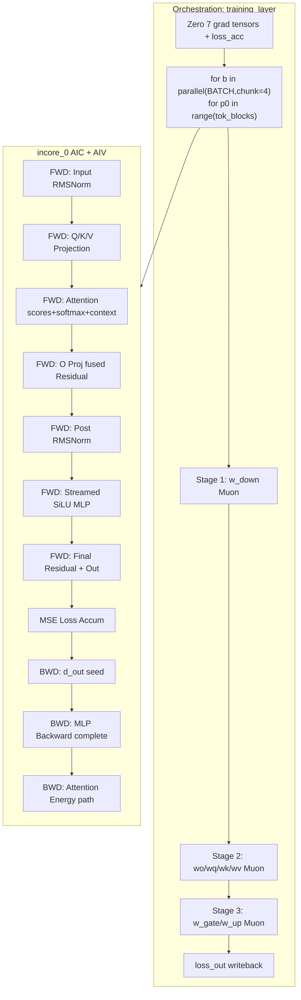

# Pass08 Local Memory and 1C+2V Flow — Complete Training Kernel

## 1. AIV (UB=160 KB) Local Tensor Inventory

| Tensor | Shape | Dtype | Bytes | KB | Purpose |
|--------|-------|-------|------:|---:|---------|
| sq_sum_0 | [1,1] | FP32 | 4 | 0.0 | RMSNorm sum of squares |
| normed_tile_0 | [1,5120] | BF16 | 10240 | 10.0 | Input RMSNorm output |
| q_proj_tile_0 | [1,5120] | BF16 | 10240 | 10.0 | Q projection result |
| k_proj_tile_0 | [1,5120] | BF16 | 10240 | 10.0 | K projection result |
| v_proj_tile_0 | [1,5120] | BF16 | 10240 | 10.0 | V projection result |
| q_acc_0 | [1,128] | FP32 | 512 | 0.5 | Q accum chunk |
| k_acc_0 | [1,128] | FP32 | 512 | 0.5 | K accum chunk |
| v_acc_0 | [1,128] | FP32 | 512 | 0.5 | V accum chunk |
| scores_0 | [1,2] | FP32 | 8 | 0.0 | Attention scores |
| context_tile_0 | [1,5120] | BF16 | 10240 | 10.0 | Attention context (BF16) |
| resid1_tile_0 | [1,5120] | FP32 | 20480 | 20.0 | O proj fused with residual |
| o_acc_0 | [1,128] | FP32 | 512 | 0.5 | O proj accum chunk |
| sq_sum2_0 | [1,1] | FP32 | 4 | 0.0 | Post-RMSNorm sum |
| post_norm_tile_0 | [1,5120] | BF16 | 10240 | 10.0 | Post RMSNorm output |
| down_tile_0 | [1,5120] | FP32 | 20480 | 20.0 | MLP down accum |
| gate_acc_0 | [1,256] | FP32 | 1024 | 1.0 | Gate MLP chunk |
| up_acc_0 | [1,256] | FP32 | 1024 | 1.0 | Up MLP chunk |
| out_tile_0 | [1,5120] | FP32 | 20480 | 20.0 | Final output tile |
| acc_t_0 | [1,1] | FP32 | 4 | 0.0 | Loss accumulator temp |
| d_post_norm_0 | [1,5120] | FP32 | 20480 | 20.0 | MLP backward d_post_norm |
| gate_r_0 | [1,256] | FP32 | 1024 | 1.0 | BWD recomputed gate |
| up_r_0 | [1,256] | FP32 | 1024 | 1.0 | BWD recomputed up |
| d_mlp_0 | [1,256] | FP32 | 1024 | 1.0 | BWD d_mlp chunk |
| bwd_energy_0 | [1,1] | FP32 | 4 | 0.0 | Attention BWD energy |
| **TOTAL** | | | **150552** | **147.0** | **91.9% of UB** |

## 2. AIC (L1=256 KB) Auto-managed

AIC tensors are allocated from tpop_from_aiv and matmul results by the ExpandMixedKernel pass.
No explicit tensor.create calls. Estimated L1 usage below 50% based on chunk sizes.

## 3. Memory Optimizations Applied

| Optimization | Savings | Detail |
|-------------|--------:|--------|
| Fuse O proj into residual | -20 KB | Eliminated separate o_proj_tile [1,5120] FP32 |
| Context stored as BF16 | -10 KB | [1,5120] BF16 vs FP32 |
| Scalar attention backward | -80 KB | Replaced d_context/d_q/d_k/d_v (4x [1,5120] FP32) with [1,1] energy |
| **Total saved** | **-110 KB** | From 257 KB (161%) to 147 KB (91.9%) |

## 4. Orchestration Flowchart

